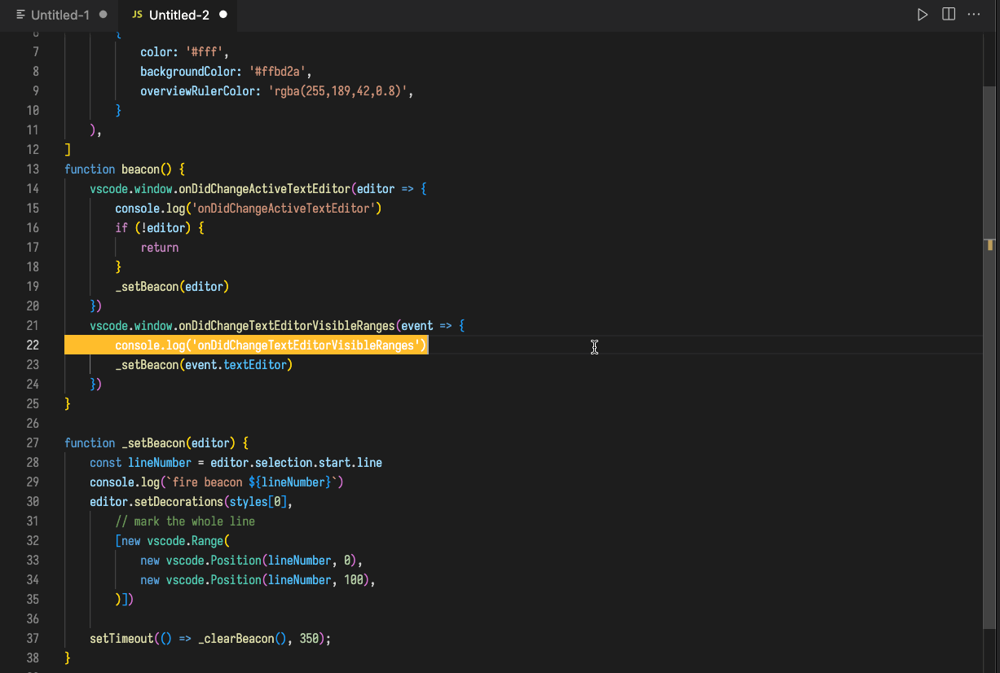

# beacon README

Where is my cursor?!

## Motivation

In emacs there is a beautiful [beacon mode: Never lose your cursor again](https://github.com/Malabarba/beacon) that reminds me where my cursor is.

I want it in vscode!

## Commands

No commands, installation fire up the beacon mode after VScode startup.

The beacon is fired when visible range is changed, e.g. `center-editor-window.center` command, or when you switch back and forth windows. 

## Notes

Unfortunately, VScode isn't as customizable as emacs, I can't highlight the whole line across the window. I can't register hooks to certain commands. But this should already be helpful.
